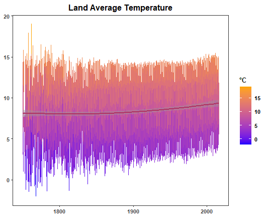
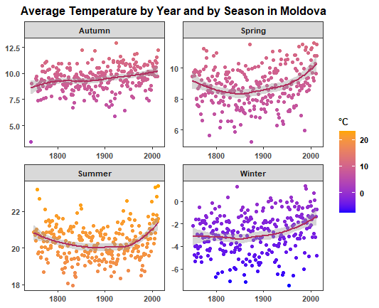
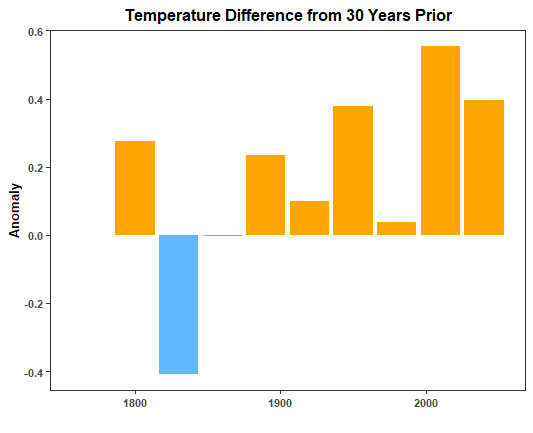

# Climate Change Analysis 

This project involves a quick analysis of global and country temperature data, 
exploring trends, and visualizing temperature changes over time. 

## Data Source

The datasets used in this project are sourced from [BERKELEY EARTH](https://berkeleyearth.org/data/), a reputable organization in climate science. however it extends up to the year 2015.

The project utilizes two main datasets:

1. `global_temp.csv`: Contains global average, minimum and maximum temperature data.

2. `global_temp_country.csv`: Contains average temperature data by country.

## Requirements

Make sure you have the following R packages installed:

- tidyverse
- lubridate
- zoo
- gganimate
- ggrepel

You can install them using the following command in R:

```R
install.packages(c("tidyverse", "lubridate", "zoo", "gganimate", "ggrepel"))
```

## Exploratory Data Analysis

The EDA section explores global temperature trends, anomalies, and 
temperature changes over different timeframes. 
Also, I included an animation that illustrate cumulative temperature anomalies in developed countries over time.  
The animation is created using the `gganimate` package.

Here are some key findings:   

**The average temperature has been increasing since 1870s.**



**Since 1900s, the winter season has experienced almost 2 degree increase in my homeland!**

  

**The temperature anomaly is getting higher, with 0.4 degrees higher in 2015 than 30 years before that.**




## License

This project is licensed under the [LICENCE CC BY-NC-SA 4.0](https://creativecommons.org/licenses/by-nc-sa/4.0/).
